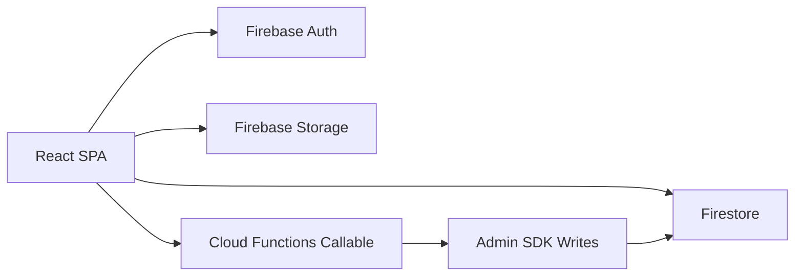

# Architecture Overview

## Frontend

- Legacy marketplace pages remain.
- New ATS app shell:
  - `src/app/platform/layout/AppRoute.tsx`
  - `src/app/platform/layout/AppLayout.tsx`
  - `src/app/platform/context/OrgContext.tsx`

## Service Layer

- `src/lib/orgs/*` contains all tenant-aware Firestore service modules.
- `src/lib/orgs/storage.ts` handles resume uploads.

## Functions

- `functions/src/index.ts` contains callable privileged handlers and audit trigger.

## Security

- Firestore rules enforce org membership + role checks.
- Storage rules isolate files by org path.
- Audit log writes are blocked in Firestore rules for client-side callers.
